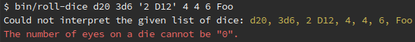
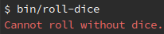

# Introduction

**D-Roll** is a dice rolling application.
It implements [zero-config/d](https://github.com/ZeroConfig/D).

# Installation

```bash
composer create-project --no-dev zero-config/d-roll
```

# Usage

The standalone application allows you to roll dice on-the-fly. It also tells you
when you roll a *CRIT*.


Because some games require a high number of dice with different number of eyes,
keeping track of them can be a pain and therefore, the application can interpret
human readable dice notations:


You will notice that one of the inputs is `3d6+10` and the last input is `6`. Under
the hood this gets added up to `4d6+10`.

The notation is also very loose. That is why `2 D12` is interpreted as `2d12`.

You will also notice that the interpreter sorts the dice by number of eyes. This
adds to the readability of the output.

When failing to supply a correct list of dice, the application will exit:



It interpreted `Foo` as `0 eyes` which is not a valid number of eyes on a die.
Everything below `2` is considered invalid, since the number must be positive,
over `0` and setting it to `1` would mean a `100%` chance, which is not a valid
reason to roll dice.

Failing to supply a list of dice, the application exits differently:


