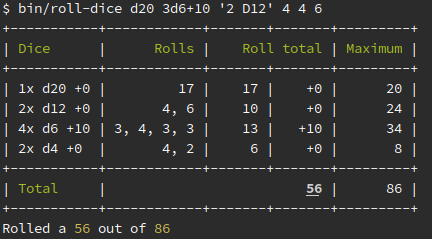

# Introduction

**D-Roll** is a dice rolling application.
It implements [zero-config/d](https://github.com/ZeroConfig/D).

# Installation

```bash
composer create-project --no-dev zero-config/d-roll
```

# Rolling dice

The standalone application allows you to roll dice on-the-fly. It also tells you
when you roll a *CRIT*.


Because some games require a high number of dice with different number of eyes,
keeping track of them can be a pain and therefore, the application can interpret
human readable dice notations:



You will notice that one of the inputs is `3d6+10` and the last input is `6`. Under
the hood this gets added up to `4d6+10`.

The notation is also very loose. That is why `2 D12` is interpreted as `2d12`.

You will also notice that the interpreter sorts the dice by number of eyes. This
adds to the readability of the output.

# Tempting fate

Another part of the application will help you tempt fate.
It is based on the [Fate RPG](https://fate-srd.com/fate-core/taking-action-dice-ladder).


One can supply a custom translation for fate values, to expand the list of
possibilities, by supplying a file with the `--config` option.

A custom configuration looks like the following:

```json
{
  "<": {
    "label": "Everything is awesome!",
    "color": "cyan"
  },
  "-1": {
    "label": "Just about awesome!",
    "color": "yellow"
  },
  "0": {
    "label": "Awesome!",
    "color": "green"
  },
  ">": {
    "label": "Ridiculously awesome!",
    "color": "cyan"
  }
}
```

Available colors are `black`, `red`, `green`, `yellow`, `blue`, `magenta`, `cyan` and `white`.
